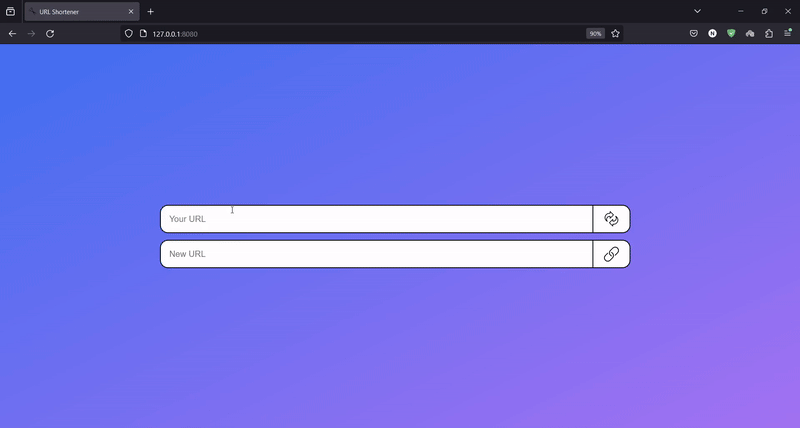

## URL Shortener
This is a simple url shortener made with flask and mongodb.\
&nbsp;\


## Installation
1) Download repository (or zip and unpack it):
```bash
git clone https://github.com/tenolly/url-shortener.git
```
2) Install dependencies:
```bash
pip install -r requirements.txt
```

## Using
Run server from the "app" directory (website available at http://127.0.0.1:8080):
```bash
python app.py
```
